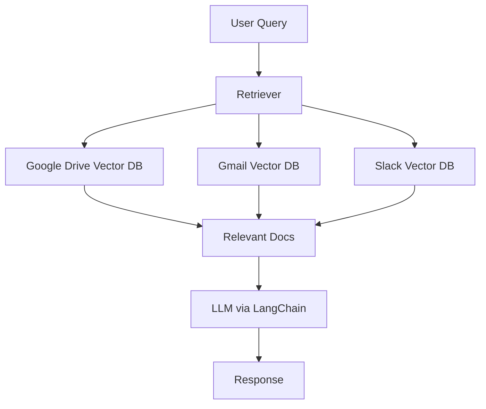

# 🔍 RAG System with Google Drive, Gmail, and Slack Integration

This project is a **Retrieval-Augmented Generation (RAG)** system that allows users to query and generate intelligent answers from their personal or organizational data sources: **Google Drive**, **Gmail**, and **Slack**. The system integrates document retrieval from multiple platforms, performs chunking, embeddings, vector storage, and uses LLMs to generate responses with strong context awareness.

---

## 🚀 Features

- ✅ **Google Drive Integration** – Fetch documents, PDFs, Google Docs and extract content for semantic search.
- ✅ **Gmail Integration** – Parse and retrieve relevant email content to power context-aware responses.
- ✅ **Slack Integration** – Extract messages from specific channels and threads for use in semantic memory.
- ✅ **ChromaDB + LangChain** – Store embeddings and enable fast vector search.
- ✅ **Multi-modal Input Sources** – Combine unstructured text from multiple sources into one RAG pipeline.
- ✅ **LLM-Powered Answers** – Query over your documents using Large Language Models (LLMs) via LangChain.
- ✅ **FastAPI + Streamlit Interface ** – Interact with the system via API or web UI.

---

## 🧠 Architecture Overview



---

## 📂 Folder Structure

```
📁 RAG-System
│
├── ingestion/
│   ├── google_drive_ingestor.py
│   ├── slack_summary_and_sync.py
│   ├── slack_ingestion.py
│   ├── vector_store.py
├── testing/
│   ├── slack.py
│   ├── slack_with_gemini.py
│   ├── gmail.py
│   ├── bot_test.py
│   ├── gd.py
├── vector_store/
│   ├── chroma
│   ├── emails
│   ├── slack_vector_db
│
├── frontend/
│   ├── ui.py  # Streamlit app
│
├── .env
├── requirements.txt
└── README.md
```

---

## ⚙️ Setup & Installation

1. **Clone the repo**
   ```bash
   git clone https://github.com/Zohaib-Sathio/Marketlytics-OneQuery.git
   cd marketlytics onequery
   ```

2. **Create `.env` file** with the following keys:
   ```
   SLACK_BOT_TOKEN=...
   GEMINI_API_KEY=...
   ```

3. **Install dependencies**
   ```bash
   pip install -r requirements.txt
   ```

4. **Authenticate Google & Slack APIs**
   - Follow OAuth setup for Google Drive and Gmail.
   - Add the bot to Slack channels manually or via API.

5. **Run the streamlit UI**
   ```bash
   streamlit run frontend/ui.py
   ```

---

## 🧪 How It Works

1. **Ingestion Pipelines**:
   - Google Drive: Extracts text from docs and PDFs.
   - Gmail: Parses emails with filters like sender, date, etc.
   - Slack: Pulls conversations from selected channels.

2. **Chunking & Embeddings**:
   - Uses LangChain text splitters and Google Embeddings.
   - Stored in ChromaDB vector store.

3. **RAG Retrieval**:
   - Query is embedded and matched against vector stores.
   - Top relevant chunks are passed to the LLM for response generation.

---

## 🛠️ Technologies Used

- Python
- LangChain
- ChromaDB
- Google API (Drive, Gmail)
- Slack SDK
- FastAPI (to be used)
- Streamlit 
- Gemini

---

---

## 🙌 Contributors

- **Zohaib** –
