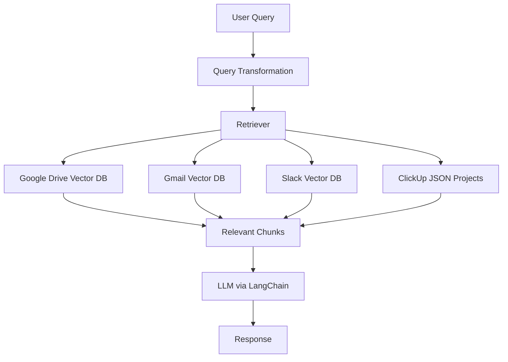

# 🔍 Org-Wide RAG System with Slack, Gmail, Google Drive & ClickUp Integration

This project is an advanced **Retrieval-Augmented Generation (RAG)** system that allows users to query organizational knowledge across various tools; **Slack**, **Gmail**, **Google Drive**, and **ClickUp** and receive intelligent, context-aware answers.

Built for internal teams, this system uses **query rewriting**, **vector-based retrieval**, and **LLMs** to deliver accurate and relevant responses from both structured and unstructured data.

---

## 🚀 Key Features

- ✅ **Query Transformation** – Reformulates vague or overly-specific queries to maximize retrieval accuracy.
- ✅ **Google Drive Integration** – Extracts content from PDFs and Google Docs for semantic search.
- ✅ **Gmail Integration** – Parses and stores relevant email content in vector DBs for long-term memory.
- ✅ **Slack Integration** – Ingests messages and auto-generated reports from dedicated summary channels.
- ✅ **ClickUp Integration** – Ingests task and project data from ClickUp; project names are intelligently mapped to other sources.
- ✅ **Vector Database** – Stores embeddings in ChromaDB for fast and accurate retrieval.
- ✅ **LLM-Powered Answers** – Uses LangChain + Gemini to synthesize insights from retrieved data.
- ✅ **FastAPI (to be used) + Streamlit Interface** – Use via API or intuitive frontend for non-technical users.

---

## 🧠 Architecture Overview




---

## 📂 Folder Structure

```
📁 RAG-System
│
|
├── config/
|
├── ingestion/
|
├── slack_data/
|
├── slack_data_projects/
|
├── testing/
|
├── vector_dbs/
|
├── vector_store/
|
├── utils/
│
├── app.py
│
├── .env
├── requirements.txt
└── README.md
```

---

## ⚙️ Setup & Installation

1. **Clone the repo**
   ```bash
   git clone https://github.com/Zohaib-Sathio/Marketlytics-OneQuery.git
   cd marketlytics onequery
   ```

2. **Create `.env` file** with the following keys:
   ```
   SLACK_BOT_TOKEN=...
   GEMINI_API_KEY=...
   ```

3. **Install dependencies**
   ```bash
   pip install -r requirements.txt
   ```

4. **Authenticate integrations**
   - Follow OAuth setup for Google Drive and Gmail.
   - Slack Bot: Add to relevant channels.
   - ClickUp: use API to fetch project details.


5. **Run the streamlit UI**
   ```bash
   streamlit run app.py
   ```

---

## 🧪 How It Works

1. **Ingestion Pipelines**:
   - Google Drive: Extracts text from docs and PDFs.
   - Gmail: Parses emails with filters like sender, date, etc.
   - Slack: Pulls conversations from selected channels and generate repotrs.
   - ClickUp: Project/task data is parsed and stored as structured JSON.
   - Query Transformer: Reformulates queries before vector search begins to improve accuracy.

2. **Chunking & Embeddings**:
   - Uses LangChain text splitters and Google Embeddings.
   - Stored in ChromaDB vector store.

3. **RAG Retrieval**:
   - Query is embedded and matched against vector stores.
   - Project names from Slack/Email/ClickUp are mapped to match with queried project.
   - Top relevant chunks are passed to the LLM for response generation.

---

## 🛠️ Technologies Used

- Python
- LangChain
- ChromaDB
- Google API (Drive, Gmail)
- Slack SDK
- FastAPI (to be used)
- Streamlit 
- Gemini
- ClickUp API

---

---

## 🙌 Contributors

- **Zohaib** –
